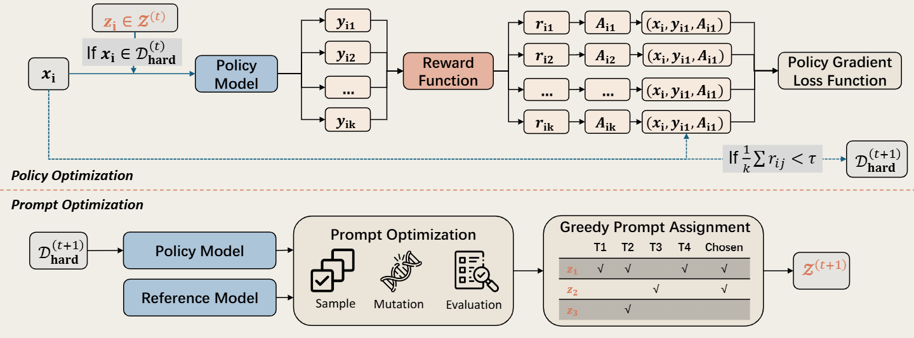

<div align="center">

# P^2O: Joint Policy and Prompt Optimization

<p>
  <a href="https://arxiv.org/pdf/2603.21877">
    
  </a>
</p>


</div>

<div align="center">
  <p>
    <a href="#overview"><b>📖 Overview</b></a> ·
    <a href="#getting-started"><b>✨ Getting Started</b></a> ·
    <a href="#contact"><b>📨 Contact</b></a> ·
    <a href="#citation"><b>🎈 Citation</b></a>
  </p>
</div>

---

<a id="overview"></a>

## 📖 Overview



Reinforcement Learning with Verifiable Rewards (RLVR) enhances Large Language Model (LLM) reasoning but suffers from advantage collapse on ``hard samples'' where all rollouts fail. This lack of variance eliminates crucial learning signals. For these intractable samples, simply scaling up rollout budgets offers limited gains. We introduce Joint Policy and Prompt Optimization (P$^2$O) to mitigate this collapse by alternating continuous policy updates with discrete prompt evolution. P$^2$O leverages the GEPA algorithm to discover successful reasoning prompts for intractable instances. Via context distillation, the model internalizes these prompt-induced gains directly into its parameters, removing the need for inference-time prompting. Empirically, P$^2$O restores critical advantage signals, significantly outperforming standard GRPO and surpassing baselines with doubled rollout budgets, ultimately yielding strong out-of-distribution generalization and an up to $9.5\%$ performance improvement. Our findings expose the limits of standard exploration in sparse-reward environments, illuminating the potential of unifying evolutionary algorithms with reinforcement learning. This integration of discrete semantic search and continuous parameter updates establishes a self-reinforcing paradigm for autonomous LLM alignment.

This repository is based on [verl](https://github.com/verl-project/verl) and provides scripts for dataset processing and training.

<a id="getting-started"></a>

## ✨ Getting Started

### 🛠️ Environment Setup

#### Docker

We recommend using the following Docker image:

```text
https://hub.docker.com/layers/verlai/verl/vllm011.latest/images/sha256-3ce56ff018516b28ab9c4f4fc09d3aa67589074495ace75e2674b720aa4d0e5d
```

After starting the container, install the extra dependency:

```bash
pip install math-verify
```

#### Manual Installation

If you prefer to build the environment manually, install the verl dependencies and the extra dependency with:

```bash
USE_MEGATRON=0 bash scripts/install_vllm_sglang_mcore.sh
pip install math-verify
```

### 📦 Data Preparation

You can download and process datasets with:

```bash
python scripts/data_process/deepscaler.py
python scripts/data_process/DeepMath-103K.py
```

The DeepMath processing script generates multiple subsets corresponding to different difficulty levels and whether problem types are balanced. As described in our paper, we use the DeepMath subset with difficulty >= 7, **located at `./data/deepmath/baseline_boxed/hard_le_7/balanced`**. This directory contains two training-set sizes, which correspond to different experiments in the paper.

### 🚀 Training

#### Self Reflection

This setting uses the reference model itself as the reflection model during GEPA iterations.
Note that we use the reference model rather than the policy model, because we found that using the policy model for reflection tends to produce prompt templates with lower diversity in later training stages.

Run:

```bash
/bin/bash my_scripts/deepmath_qwen_3_4B_in_distribution_ref_model_reference_replace_hard_clip_0.01-10.sh
```

#### Kimi Reflection

This setting uses a stronger model as the reflection model.
In our paper, we use Kimi as the reflection model.

Before running this script, set `API_BASE` to your Kimi-compatible API endpoint.
**You also need to insert your API key into `./verl/trainer/ppo/api_keys.txt`, which is read by the script through `API_KEY_FILE_PATH='api_keys.txt'`.**

Run:

```bash
/bin/bash my_scripts/deepscaler_qwen_3_4B_in_distribution_ref_model_kimi_replace_hard_clip_0.01-10.sh
```

#### ⚙️ Key Parameters

| Parameter | Default | Description |
|-----------|---------|-------------|
| `trainer.gepa.dev_ratio` | `300` | Validation set size used during GEPA iterations. |
| `trainer.gepa.gepa_select_pareto_k` | `16` | Parallelism for GEPA exploration. We do not recommend changing this value, as it may affect training efficiency. |
| `trainer.gepa.api_base` | Required | API endpoint of the reflection model. A separate reflection-model API service is required for GEPA iterations at the end of each epoch. |
| `trainer.gepa.model_name` | Required | Name of the reflection model. |
| `trainer.gepa.auto` | `"heavy_4"` | GEPA budget. We do not recommend changing this value. The default `"heavy_4"` corresponds to 4x the budget of the original GEPA algorithm. |

### 📊 Evaluation

We employ the open-source evaluation suite2 provided by Qwen for all mathematical benchmarks: https://github.com/QwenLM/Qwen2.5-Math/tree/main/evaluation

<a id="contact"></a>

## 📨 Contact

- **Kaiqi Zhang**:  zhangkaiqi.zlk@gmail.com
- **Xinyu Lu**: luxinyu2021@iscas.ac.cn

<a id="citation"></a>

## 🎈 Citation

If you find this work helpful, please cite us:

```bibtex
@article{lu2026p,
  title={P\^{} 2O: Joint Policy and Prompt Optimization},
  author={Lu, Xinyu and Zhang, Kaiqi and Yang, Jinglin and Cao, Boxi and Lu, Yaojie and Lin, Hongyu and He, Min and Han, Xianpei and Sun, Le},
  journal={arXiv preprint arXiv:2603.21877},
  year={2026}
}
```
